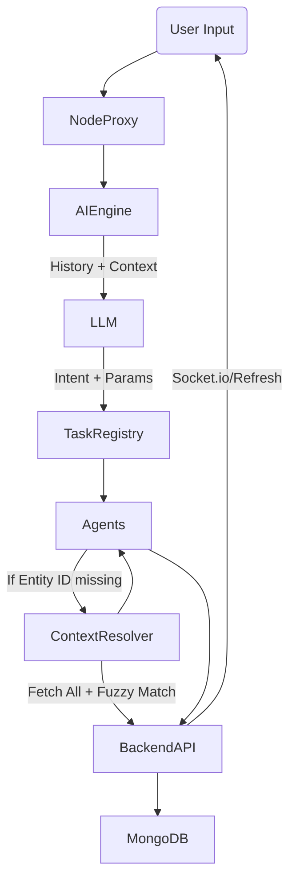

# Complete Agentic AI Architecture Overview

This document outlines the architecture and data flow for the AgriSpine AI System. It acts as an orchestrator across all backend services (Crops, Market, Machinery, Community, Weather).

## System Architecture

1. **Frontend Proxy to AI (`aiRoutes.js`)**
   - Injects the authenticated `userContext` and `pageContext`.
   - Passes the full `history` array to the AI Engine for conversation memory.

2. **The LLM Engine (`ai/core/engine.py`)**
   - Evaluates the current message **in the context of `history`**.
   - Solves the Missing Parameter problem natively (e.g. knowing that "Add expense" is for the crop discussed two messages ago).
   - Maps requests into one of 40+ registered intents.

3. **Task Registry (`ai/core/task_registry.py`)**
   - The central router. It contains no business logic.
   - Simply imports agent functions (e.g. `execute_add_crop`) and dispatches based on the LLM's classification.

4. **Modular Agents (`ai/core/agents/`)**
   - `crop_agent.py`, `expense_agent.py`, `machinery_agent.py`, etc.
   - Encapsulate the specific HTTP payloads and paths required to talk to the Node backend.

5. **Shared Context Resolver (`ai/core/context_resolver.py`)**
   - When an agent is called (e.g. `ADD_EXPENSE` for "Paddy"), the agent uses this module.
   - It fetches all crops (or conversations/machinery), pipes them through `smart_matcher.py` for >90% fuzzy similarity, and seamlessly resolves the internal MongoDB `_id` without user input.

6. **MongoDB & Socket Emit (`backend/controllers/`)**
   - Receives the perfectly constructed request.
   - Mutates data.
   - Emits Socket.io realtime events back to the UI.

## Flow Diagram

